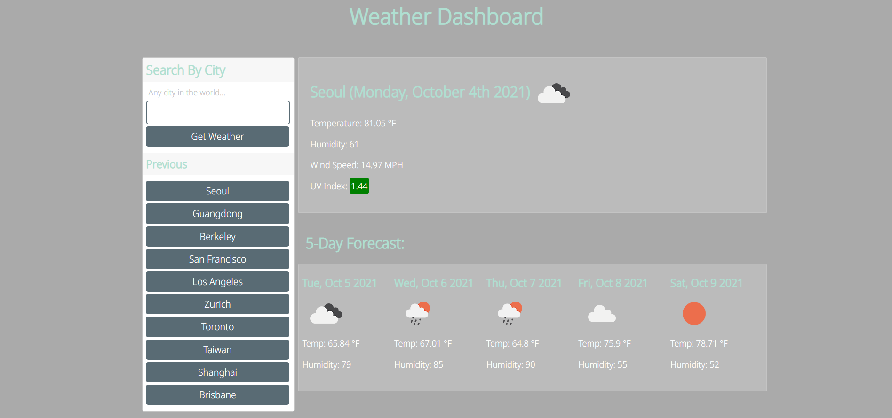

# Weather Dashboard

## Description
A user can use this application to get the current weather as well as a five day forecast for cities around the world. It saves their 10 most recent searches. The weather data a user can view include: temperature, humidity, wind speed, and ultraviolet index.
NOTE: The data are shown in imperial units, for example: temperature in Farenheight and wind speed in miles per hour.

When a user searches for a city, the app first makes a request to OpenWeather's Geocoding API. This gets the coordinates of the city's location, and this information is used by another request to OpenWeather's One Call API. We are then responded by a set of data regarding that city's weather information. Relevant information about the current weather as well as the five day forecast are then displayed on the page. The user can find their ten most recent searches below the search bar and they can click these buttons to display that city's weather. This history is stored in localStorage. 

To view the web page visit this [link](https://mushymane.github.io/weather-dashboard/)

## Preview


## Technologies Used
- HTML - used to structure and create elements on the DOM
- CSS - styles the HTML elements on page
- JavaScript - provides the site's functionality
- jQuery - JS library for simplified DOM traversal
- Moment.js - JS library for manipulating time
- Git - version control
- Github - where the repository is hosted
- Visual Studio Code - text editor
- Bootstrap - CSS framework
- Google Fonts - variety of fonts
- OpenWeather API - weather data around the world

## Code Snippet
One of the API requests. Used to get latitude and longitude of a city
```
function getCoordinates(city) {
    var apiUrl = "http://api.openweathermap.org/geo/1.0/direct?q=" + city + "&limit=1" + "&appid=" + appid;

    fetch(apiUrl).then(function (response) {
        if (response.ok) {
            response.json().then(function (data) {
                // Get lat and lon properties from response
                var lat = data[0].lat.toString();
                var lon = data[0].lon.toString();
                renderWeather(lat, lon, data[0].name);
            });
        } else {
            alert('Error: ' + response.statusText);
        }
    });
}
```

## Author Links
[LinkedIn](https://www.linkedin.com/in/luigilantin/)
[Github](https://github.com/mushymane)